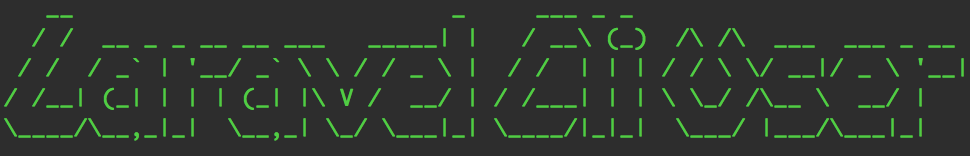

# Laravel CLI User
> Manage users easily on command line

 

You can quickly create, delete and list users on command line

## Requirements

PHP 5.4+  
Tested on Laravel 5.1, 5.2, 5.3 and 5.4

## Installation

```bash
composer require subdesign/laravel-cli-user:^1.0.0
```

Add the following line to the service providers array in the `config/app.php` file
```php
Subdesign\LaravelCliUser\CliUserServiceProvider::class
```

Publish the config file
```bash
php artisan vendor:publish --provider="Subdesign\LaravelCliUser\CliUserServiceProvider"
```
## Configuration

Edit the `config/cliuser.php` config file to set where your User model exists.

```php
return [
    'model' => 'App\User'
];
```

## Usage

#### Create user

```bash
php artisan cliuser:create
```

Show password letters
```bash
php artisan cliuser:create --show-password
```

#### Delete user

Delete user by ID
```bash
php artisan cliuser:delete <id>
```

Delete user by email
```bash
php artisan cliuser:delete <email@example.com>
```
> Of course do not enter < and > characters only an interger or string as email 

#### List users

```bash
php artisan cliuser:list
```

## Credits

&copy; 2017 [Barna Szalai](https://github.com/subdesign)

## License

The MIT License (MIT). Please see [License File](LICENSE.md) for more information.
